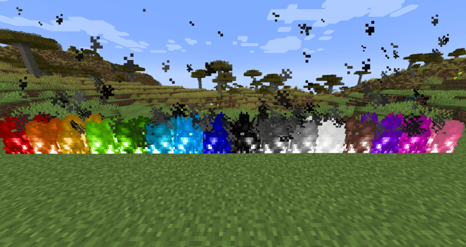
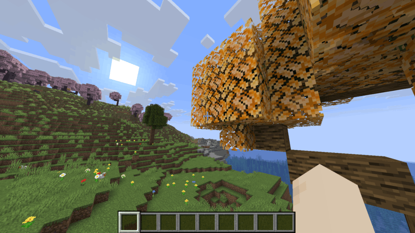
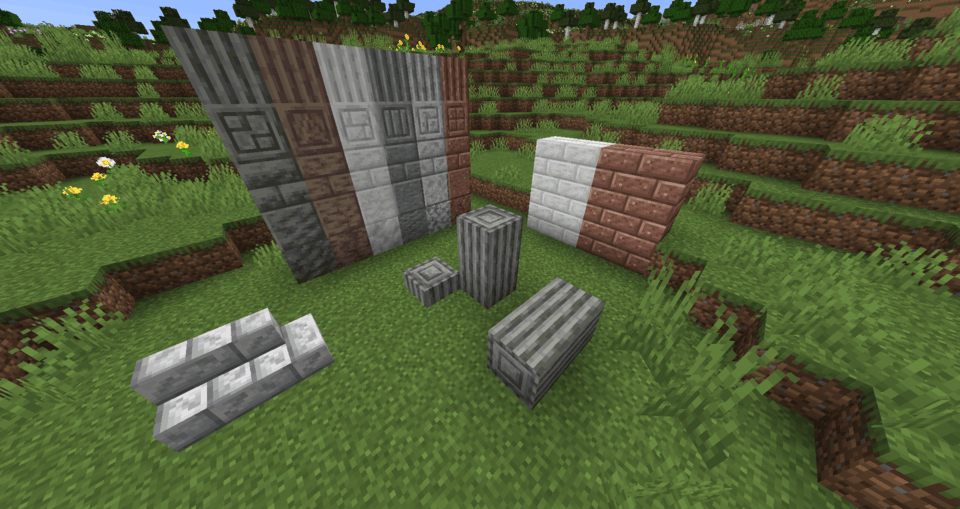
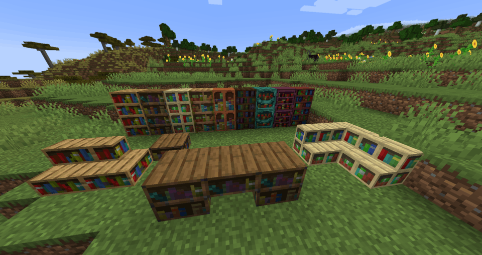
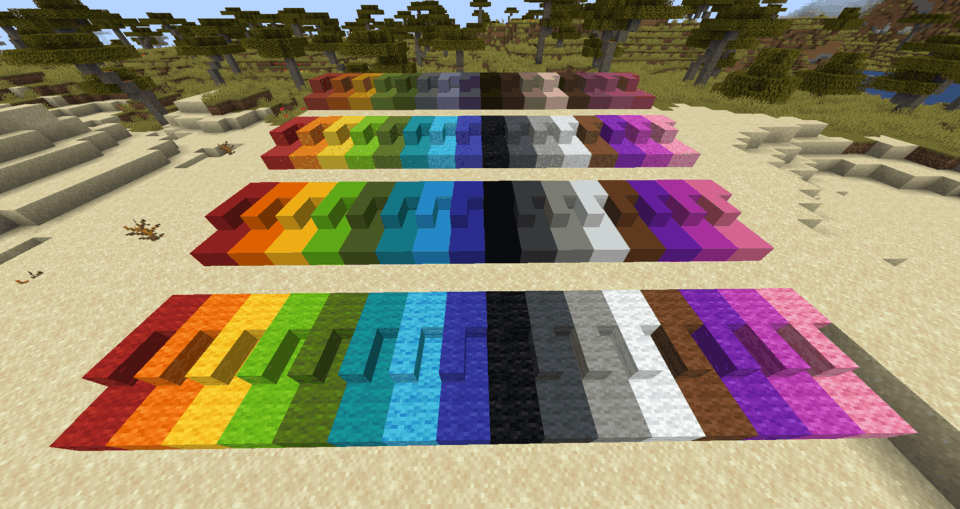

<div align="center">

  <!---->
  <h1>
    Spout server / Spoutcraft client<br>(Paper,  Fabric)
  </h1>
  <h3>
    Vanilla-compatible server + client
    <br>
    that automatically sends modded content from server to client
  </h3>

[](https://discord.gg/EduvcVmKS7)
[](#Downloads)

</div>

<table>
  <tr>
    <td>
      <a href="design/fire.png"></a>
    </td>
    <td>
      <a href="design/orange.png"></a>
    </td>
    <td>
      <a href="design/stone.png"></a>
    </td>
  </tr>
  <tr>
    <td>
      <a href="design/lantern.png"></a>
    </td>
    <td>
      <a href="design/bookshelves.png"></a>
    </td>
    <td>
      <a href="design/concrete.png"></a>
    </td>
  </tr>
</table>

# Server

## Introduction

Spout lets you add new blocks and items on a Paper server, fully server-side.\
When players join, the new blocks and items will be added client-side too.

&nbsp;&nbsp;&nbsp;&nbsp;✓&nbsp;&nbsp;Automatically sends custom content to clients with the Spoutcraft mod
<br>
&nbsp;&nbsp;&nbsp;&nbsp;✓&nbsp;&nbsp;Works with other clients too, including vanilla
(with/without resource pack)
<br>
&nbsp;&nbsp;&nbsp;&nbsp;✓&nbsp;&nbsp;Support for all Bukkit / Spigot / Paper plugins

A Fabric server mod is planned.
Please let us know on [Discord](https://discord.gg/EduvcVmKS7) if you are interested.

## Downloads

[](https://github.com/ModernSpout/Spout/releases/download/1.9/spout-26.1.2-R1.9.jar)

## Installation

The `.jar` file is a drop-in replacement for the Paper JAR, and you can run it the same:

```sh
java -jar spout-26.1.2-R1.9.jar
```

Please report any issues you encounter.
As always, backup your server regularly.

## Adding custom blocks and items

New blocks and items can be added by Paper plugins that support Spout.

### Spout plugin showcase

* [Quark](https://github.com/ModernSpout/Quark-plugin)
* [Chinese paper lamps](https://hangar.papermc.io/Spout/ChinesePaperLamps)
* [Snowy stone bricks](https://hangar.papermc.io/Spout/SnowyStoneBricks)

### Creating a Spout plugin

It's very simple:
1. Create a regular Paper plugin
2. Add the Spout API as a dependency
3. Define your content with a data and resource pack

See the step-by-step guide on the
<a href="https://github.com/ModernSpout/Spout/wiki/*-Making-a-Spout-plugin">wiki</a>!

## Current known issues

* Vanilla clients cannot see block display entities, falling blocks and stonecutter recipes for custom blocks.

# Client

## Introduction

Spoutcraft works like a per-server modloader: the moment you join a Spout server,
the server's modded content will be transferred and added client-side automatically.

&nbsp;&nbsp;&nbsp;&nbsp;✓&nbsp;&nbsp;Supports non-vanilla block shapes, like vertical slabs
<br>
&nbsp;&nbsp;&nbsp;&nbsp;✓&nbsp;&nbsp;Supports all properties, including breaking speed, light level and textures
<br>
&nbsp;&nbsp;&nbsp;&nbsp;✓&nbsp;&nbsp;Auto-completion in commands, such as <code>/give</code>

Because it contains no modded blocks or items of itself, the Spoutcraft client mod is super lightweight.
<br>
It is incredibly fast: a server's modded content is downloaded and added in less than a second.
<br>
The client only accepts a server's text description of block and item types.
No server code is ever transferred or executed.
<br>
All custom content is automatically removed the moment you leave a server.

## Downloads

[](https://github.com/ModernSpout/Spout/releases/download/1.9/spoutcraft-1.9.0.jar)
[](https://modrinth.com/mod/spout-client)
[](https://www.curseforge.com/minecraft/mc-mods/spout)

## Installation

Place the `.jar` file into the `mods` folder.

Requires [Fabric API](https://modrinth.com/mod/fabric-api).

Compatibility with other mods has not been explored fully.\
Please report if you encounter any issues.

<!--
## Next

The next goals of the project are:

* More ways to serve the resource pack
* More types of blocks and items

Afterward, goals of the project are:

* Custom block types, item types, block entities and entities
* Using display entities to display custom blocks to vanilla clients

Don't hesitate to suggest ideas, send in PRs (we will take a serious look at every PR, even if it is only a draft),
or ask to join the project as a developer.
-->

# Acknowledgements

This project is heavily inspired by the original
[Spoutcraft / BukkitContrib](https://github.com/spoutcraft) project.
This project would not exist without the ideas and work that those who worked on it put forward.
Additionally, this project builds on top of the work of the contributors to
[Paper](https://github.com/PaperMC/Paper) and [Spigot](https://www.spigotmc.org/), and
[Fabric](https://fabricmc.net/) and [Sponge](https://spongepowered.org/).

Also, thanks go out to
[Alvinn8](https://github.com/Alvinn8/),
[SoSeDiK](https://github.com/SoSeDiK) and
[zoumath19](https://github.com/zoumath19)
for their contributions to this project.
